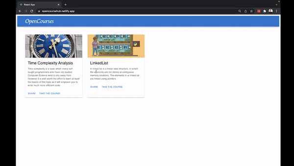

# OpenCourseHub

This is a platform where you can aggregate the course resources at one place 

### [Website Link - https://opencoursehub.netlify.app/](https://opencoursehub.netlify.app/)

### Demo

## Adding new Course 
- create new js file in `./src/resources` , template can be copied from existing courses
- Add the course in file `./src/resources/allcourses.js` in `courses` array

